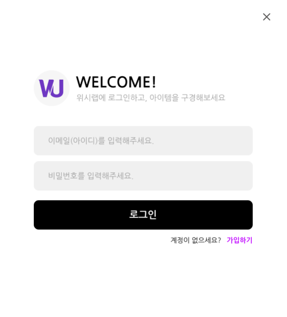
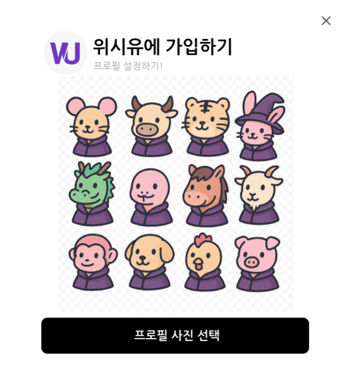
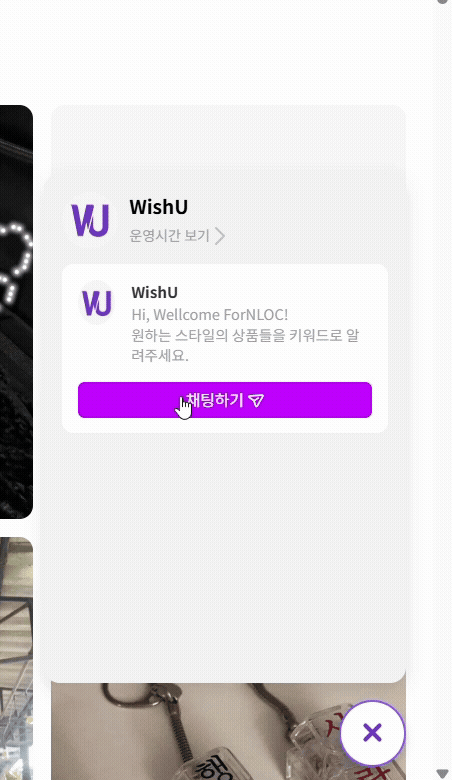

# WishU

Pinterest 감성 + 위시리스트 기능이 만난  
나만의 취향 큐레이션 웹 서비스, WishU!

---

## 프로젝트 소개

<p>
  <strong>WishU</strong>는 사용자가 마음에 드는 상품을 시각적으로 저장하고,  
  다른 사람의 위시 아이템도 함께 둘러볼 수 있는 감성 큐레이션 웹 서비스입니다.  
  카드형 위시 피드, 챗봇 추천, 북마크, 마이페이지 등 다양한 기능을 통해  
  나의 취향을 한곳에 모으고 공유할 수 있습니다.
</p>

---

## 주요 기능

- 이메일 기반 회원가입 및 프로필 설정  
- 무한스크롤 피드 + 카테고리/정렬 필터  
- 상품 상세 정보 조회 + 좋아요/댓글/북마크  
- 사용자 상품 등록 (태그 자동 분류)  
- 챗봇 추천으로 취향 기반 상품 탐색  
- 마이페이지에서 활동 이력 관리

---

## 시연 화면 (GIF)

### 1. 로그인 / 회원가입

<p>
  이메일 주소를 기반으로 한 간편한 회원가입과 로그인
</p>

<table>
  <tr>
    <td>
      
    </td>
    <td>
      
    </td>
  </tr>
</table>

---

### 2. 메인 피드

<p>
  무한 스크롤로 구성된 카드형 위시 피드입니다.  <br/>
  카테고리(의류, 뷰티 등)별 필터와 정렬을 지원하며,  <br/>
  상품을 둘러보고 상품을 담거나 댓글을 달 수 있습니다.<br/>
</p>


---

### 3. 상품 등록 및 상세 페이지

<p>
  사용자가 직접 상품 정보를 입력하여 등록할 수 있는 화면입니다.  <br/>
  이미지, 제목, 가격, 설명을 작성하고 태그 및 카테고리를 지정할 수 있습니다.  <br/><br/>
  등록된 상품은 상세 페이지에서 이미지, 브랜드, 가격 등의 정보를 확인할 수 있으며,  <br/>
  좋아요, 댓글, 외부 링크 이동, 북마크 저장 등의 인터랙션이 가능합니다.
</p>


---

### 5. 마이페이지

<p>
  내가 저장한 상품, 북마크한 위시를 확인할 수 있는 개인 페이지입니다.
</p>


---

### 6. 공유 위시 & 친구 기능

<p>
  친구를 추가하고 요청을 승인하거나 거절할 수 있으며, <br/> 
  친구로 등록된 사용자의 프로필에 접속해 공유된 위시 상품을 열람할 수 있습니다.  <br/>
  상대방의 관심사를 시각적으로 확인하고, 취향 기반으로 소통할 수 있는 기능입니다.  <br/>
  <strong>공유된 위시 상품에는 실시간 댓글을 통해 친구와 자유롭게 대화할 수 있습니다.</strong>
</p>


---

### 7. 챗봇 추천

<p>
  사용자가 담은 상품에 포함된 키워드를 기반으로  <br/>
  원하는 스타일의 상품을 추천해주는 챗봇 인터페이스입니다.  <br/>
  카테고리별 태그 선택과 간단한 대화형 입력을 통해  <br/>
  유사한 상품을 탐색할 수 있으며,  <br/>
  <strong>키워드 기반 추천 방식</strong>으로 최종 구현되었습니다.
</p>


---

## 팀 소개

| 역할 | 이름 |
|------|------|
| 기획 & 프론트엔드 | 이예빈, 남채빈, 오주희, 최수진 |
| 백엔드 | 이예빈, 남채빈, 오주희, 최수진 |

<p>
  웹응용소프트웨어학과 F4(Frontend 4)조가 함께 개발한 감성 큐레이션 웹 프로젝트입니다.
</p>

---

## 기술 스택

- **React 18** (with TypeScript)  
- **React Router**  
- **Styled-components** or **CSS Modules**  
- **Axios** (API 통신)  
- **Create React App (CRA)**

---

## 설치 및 실행

```bash
# 1. 의존성 설치
npm install

# 2. 개발 서버 실행
npm start
